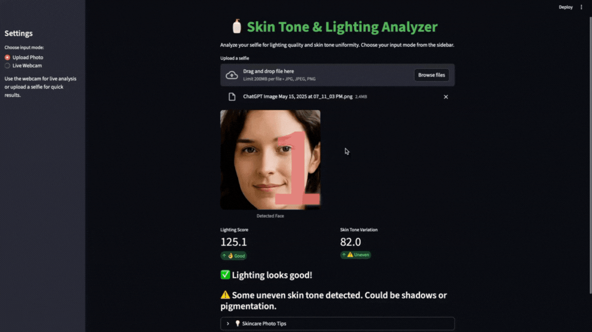

# 🧴 Skin Tone & Lighting Analyzer

A Streamlit app that analyzes facial lighting conditions and skin tone uniformity using OpenCV. Users can either **upload a selfie** or use **live webcam detection** for real-time analysis.

---

## Features

- Detects face from uploaded photo or live webcam
- Calculates **lighting score**
- Calculates **skin tone variation**
- Provides **human-friendly feedback** on lighting and skin uniformity
- Works entirely without machine learning models

---

## Demo

  
<p align="center">
  
</p>


---

## Tech Stack

- Python  
- Streamlit  
- OpenCV  
- NumPy  
- Pillow  

---

## Installation

1. Clone the repository:
```bash
git clone https://github.com/yahyaim/skin-tone-detector.git
cd skin-tone-detector
```
2. Install dependencies:
```bash
pip install streamlit opencv-python numpy pillow
```
3. Ensure the Haar cascade file is present inside your virtual environment:
```bash
haarcascade_frontalface_default.xml
```

## Usage
Run the app:
```bash
streamlit run app.py
```
1. Choose Upload Photo to analyze a selfie, or Live Webcam to take a photo with your camera.
2. The app detects your face and provides:
    - Lighting score (brightness)
    - Skin tone variation
    - Feedback messages

## Notes

- Best results with front-facing selfies
- Works in modern browsers for webcam input
- No training or cloud API required

## Future Improvements

- Real-time continuous webcam analysis
- Enhanced skin detection using YCbCr or other color spaces
- Download analysis report or save results
- More advanced lighting and skin quality metrics

